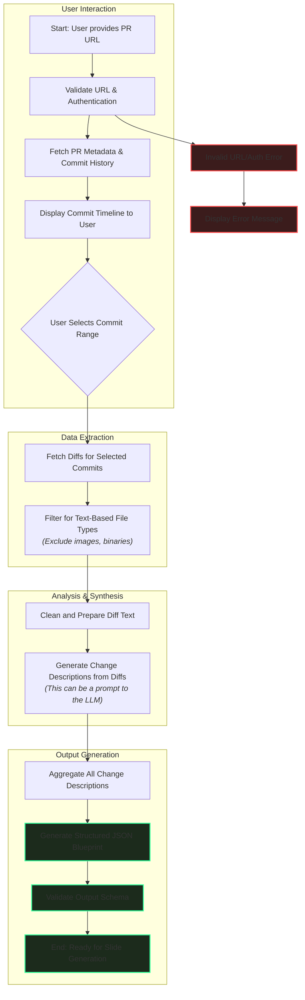

```mermaid
graph TD
    subgraph "User Interaction"
        A["Start: User provides PR URL"] --> B["Validate URL & Authentication"];
        B --> C["Fetch PR Metadata & Commit History"];
        C --> D["Display Commit Timeline to User"];
        D --> E{"User Selects Commit Range"};
    end

    subgraph "Data Extraction"
        E --> F["Fetch Diffs for Selected Commits"];
        F --> G["Filter for Text-Based File Types<br><i>(Exclude images, binaries)</i>"];
    end

    subgraph "Analysis & Synthesis"
        G --> H["Clean and Prepare Diff Text"];
        H --> I["Generate Change Descriptions from Diffs<br><i>(This can be a prompt to the LLM)</i>"];
    end

    subgraph "Output Generation"
        I --> J["Aggregate All Change Descriptions"];
        J --> K["Generate Structured JSON Blueprint"];
        K --> L["Validate Output Schema"];
        L --> W["End: Ready for Slide Generation"];
    end

    %% Error Handling for Authentication
    B --> X["Invalid URL/Auth Error"];
    X --> Y["Display Error Message"];
    
    %% Styling
    classDef errorNode fill:#3b1c1c,stroke:#ff4d4d,stroke-width:2px;
    classDef outputNode fill:#1c2b1c,stroke:#33ff99,stroke-width:2px;
    
    class X,Y errorNode
    class K,L,W outputNode
```