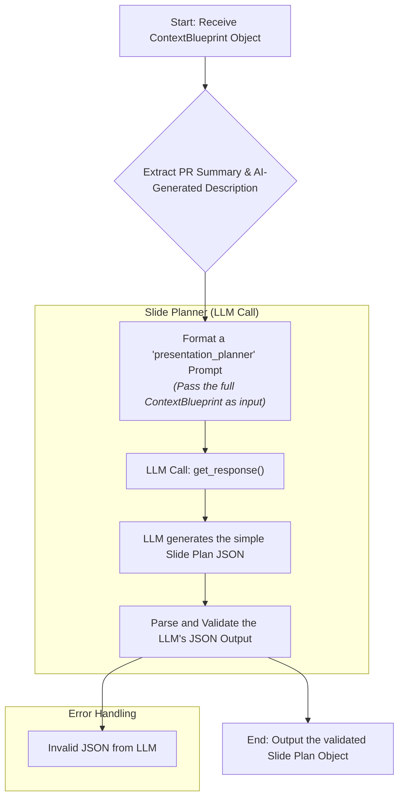

```mermaid
graph TD
    A["Start: Receive ContextBlueprint Object"] --> B{"Extract PR Summary & AI-Generated Description"};

    subgraph "Slide Planner (LLM Call)"
        C["Format a 'presentation_planner' Prompt<br><i>(Pass the full ContextBlueprint as input)</i>"];
        D["LLM Call: get_response()"];
        E["LLM generates the simple Slide Plan JSON"];
        F["Parse and Validate the LLM's JSON Output"];
    end

    B --> C --> D --> E --> F;

    G["End: Output the validated Slide Plan Object"];

    F --> G;

    subgraph "Error Handling"
        H["Invalid JSON from LLM"];
    end

    F --> H;
```