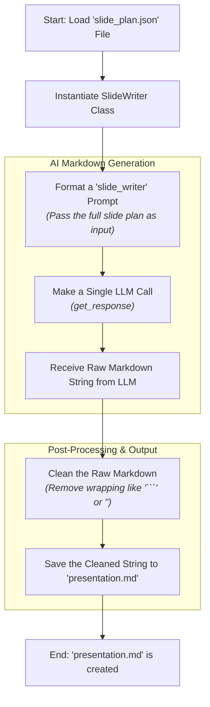

```mermaid
graph TD
    A["Start: Load 'slide_plan.json' File"] --> B["Instantiate SlideWriter Class"];

    subgraph "AI Markdown Generation"
        C["Format a 'slide_writer' Prompt<br><i>(Pass the full slide plan as input)</i>"];
        D["Make a Single LLM Call<br><i>(get_response)</i>"];
        E["Receive Raw Markdown String from LLM"];
    end

    B --> C --> D --> E;

    subgraph "Post-Processing & Output"
        F["Clean the Raw Markdown<br><i>(Remove wrapping like '```' or '<tags>')</i>"];
        G["Save the Cleaned String to 'presentation.md'"];
    end

    E --> F --> G;

    H["End: 'presentation.md' is created"];
    G --> H;
```